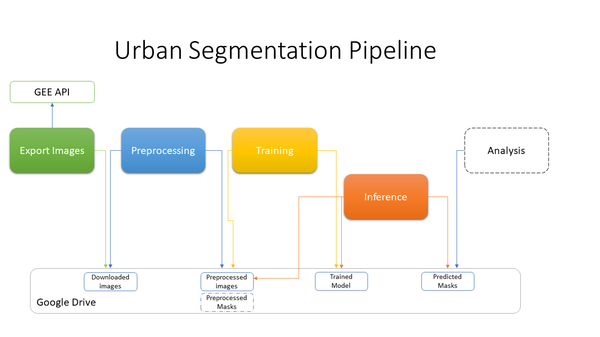
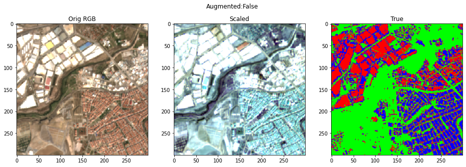
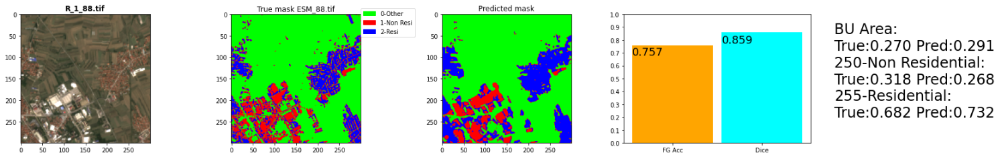

# urban_segmentation
Urban segmentation on multi channel satellite images to identify Residential and Industrial built up areas

MLDS MSc Final Project - Reichman University 2022

 

## Intro
The repo contains the code implementation and trained models for the pipeline described above.
The model was trained on 700 [Sentinel2 GeoTiff images](https://developers.google.com/earth-engine/datasets/catalog/COPERNICUS_S2_SR) and 700 matching [ESM masks](https://land.copernicus.eu/pan-european/GHSL/european-settlement-map/esm-2015-release-2019?tab=download)
A sample input image (before and after preprocessing) and matching ESM mask:

Our model scored a [Dice]([https://towardsdatascience.com/metrics-to-evaluate-your-semantic-segmentation-model-6bcb99639aa2#:~:text=The%20Dice%20coefficient%20is%20very,similarity%20between%20predicted%20and%20truth](https://towardsdatascience.com/metrics-to-evaluate-your-semantic-segmentation-model-6bcb99639aa2)) score of 0.83 on test images and was successfully used to predict images on another part of the world:

## Code
See the [notebooks](notebooks/) folder for all relevant notebooks:
- [NB0](notebooks/NB0%20Predict.ipynb) - Preprocessing and inference only
- [NB1](notebooks/NB1%20Exporting%20Sentinel%202%20Images%20from%20GEE) - Download new images from Google Earth Engine
- [NB2](notebooks/NB2%20EDA%20and%20Preprocessing%20for%20Training.ipynb) - EDA and Preprocessing for Training
- [NB3](notebooks/NB3%20Preprocessing%20for%20Inference.ipynb) - Minimal Preprocessing for Training or Inference
- [NB4](notebooks/NB4%20Urban%20Segmentation%20Training%20Pipeline%20(PyTorch%20UNET)) - Training a new UNET segmenetation model
- [NB5](notebooks/NB5%20Urban%20Segmentation%20Pipeline%202%20(PyTorch%20DeepLabV3)) - Training a new DeepLabv3 segmenetation model
- [NB6](notebooks/NB6%20Inference%20Pipeline%20(PyTorch%20UNET)) - Inference only
- [NB7](notebooks/NB7%20Experiments_Results_Analysis.ipynb) - Training results analysis

# How to use this repo
## Downloading new Satellite images foor prediction
- Use [NB1](notebooks/NB1%20Exporting%20Sentinel%202%20Images%20from%20GEE) to download new images, you will need a [GEE account](https://code.earthengine.google.com/) and a Google Drive with free space for storing the images.
- The output will be a directory in google drive with your downloaded images.

## Inference
- Use [NB0](notebooks/NB0%20Predict.ipynb) to preprocess and predict new masks for your downloaded images
- Or if you prefer you can preprocess using [NB3](notebooks/NB3%20Preprocessing%20for%20Inference.ipynb) and then do Inference separately using [NB6](notebooks/NB6%20Inference%20Pipeline%20(PyTorch%20UNET))
- The output will be a directory with the predicted masks

## Training a new model for your data
- Use [NB2](notebooks/NB2%20EDA%20and%20Preprocessing%20for%20Training.ipynb) (or [NB3](notebooks/NB3%20Preprocessing%20for%20Inference.ipynb)) for Preprocessing and [NB4](notebooks/NB4%20Urban%20Segmentation%20Training%20Pipeline%20(PyTorch%20UNET)) (or [NB5](notebooks/NB5%20Urban%20Segmentation%20Pipeline%202%20(PyTorch%20DeepLabV3))) for Training
- Use [NB7](notebooks/NB7%20Experiments_Results_Analysis.ipynb) for analyzing
- The output will be a PyTorch model, and a directory with the predicted masks used for testing

