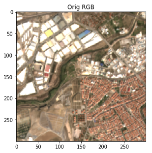
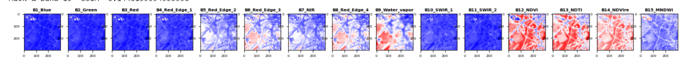
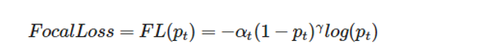

<head>

</head>
<body>

<h1 style="text-align:center;">Semantic Segmentation of Built-Up Areas in Satellite Imagery</h1>

Mentors: [Tomer Fishman](t.fishman@cml.leidenuniv.nl) (Leiden University),[Yoav Peled](yoav.pld@gmail.com) (RU school of Sustainability),[Leon Anavy](leon.anavy@gmail.com) and [Alon Oring](alon.oring88@gmail.com) (RU school of CS)

By: [Eli Terris-Assa](eliterrisassa@gmail.com) and [Liad Levi-Raz](liad.leviraz@gmail.com)

<h1>Abstract</h1>

<h2>The domain</h2>

Satellite-based sensors capture imagery in visible light and in other wavelengths such as infrared and radar, which reveals a view of heterogeneous environments, composed of natural, agricultural, and built-up areas. These, in turn, vary between different contexts, including natural ones such as continents, climates, water bodies and biomes, and man-made ones such as economic activities, population densities, architectural styles, and urban planning. 
Global environmental change is caused by expansion of human use of the environment, a complex process involving multiple interlinked factors, causes and effects. In order to better understand these processes, the detection and classification of different urban morphologies is needed.

<h2>The objective</h2>

The aim of this project is to carry out Semantic Segmentation on space-borne derived data. The project is expected to provide a ML algorithm that will divide the identified built-up areas into different building classes (Residential and Non-Residential) for the general use of sustainability research and/or others.
Given a set of satellite images and corresponding masks for these images, detailing which segments are residential and which are non residential, we trained a model to perform image segmentation and then used this model for inferring the segments of new unseen satellite images, and to calculate the proportion of residential and non residential areas in every image.

<h2>The dataset</h2>

Our dataset is a collection of satellite images downloaded from Google Earth and their matching manually classified mask images, for residential and non residential areas.

- 700, 10 meters resolution, satellite images of Europe - 11 bands (channels) – extracted from Google Earth Engine (GEE) ([Sentinel 2 surface imagery on Google Earth Engine](https://developers.google.com/earth-engine/datasets/catalog/COPERNICUS_S2_SR?hl=en))
- 700 Masks of Residential vs Non Residential areas (“Blue”,“Red” below) – this is a per pixel segmentation of Residential (Blue), non Residential (Red), and other areas (Green)  - available from the [Copernicus website (for Europe only)](https://land.copernicus.eu/pan-european/GHSL/european-settlement-map/esm-2015-release-2019?tab=metadata) (Resolution of 10m, size will conform to the input image size)

<table border=1 class="center">
<tr>
<td>
<td>
</tr>
<tr>
<td>An example of an input image
</td>
<td>An example of a mask
</td>
</tr>
</table>

Orignially the dataset includes the following 11 bands:

<h2>The methods we used </h2>

For Image Segmentation use cases, and more specifically for Satellite images segmentation, one of the most popular approaches is to use a neural network which is a flavor of the [U-Net architecture](https://en.wikipedia.org/wiki/U-Net) (originally developed for biomedical image segmentation). The network is based on the fully convolutional neural network, where the name “U-NET” comes from its U-shaped encoder-decoder network architecture, which originally consisted of 4 encoder blocks and 4 decoder blocks that are connected via a latent space. The encoder halves the spatial dimensions and doubles the number of filters (feature channels) at each encoder block, and the decoder doubles the spatial dimensions and halves the number of feature channels

Image source [U-net from paperswithcode](https://paperswithcode.com/method/u-net)

In addition we also experimented with the “DeepLabV3” which is currently considered to be the state of the art for image segmentation, however in our experiments we got slightly better results with UNET.

<h2>Major challenges</h2>

1. One of the main challenges was to learn how to work with **multi-channel GeoTIFF images**, instead of the ‘default’ RGB channels; more details on how we approached it in the next section.
2. **Class imbalance** - usually in satellite images this is the case where the background (uninteresting class) captures most of the image, more details on how we approached it in the next section.
3. **Masks data is available for Europe only** – training can be done on Europe only, thus it is most likely that we will experience distribution drift and inference performance on areas with different characteristics than Europe will be poor. However, since the end purpose is to infer on a “Continent level” – it is possible that the error will be reasonable. Another future direction can be to use additional annotated data for methods such as Transfer Learning. 
4. Masks of residential vs non-residential were created by an algorithm we don’t have access to, so the model we will create will basically imitate these results (including the errors…)
5. Data export – the data export process from Google Earth engine is a very sensitive one, in order to provide an end-2-end pipeline of data export and inference, we learned to work with the GEE for exporting new images.

 
<h2>Related work</h2>

This project does not follow any particular single anchor paper, however the methods we applied for preprocessing, training and evaluation of the model are inspired by the following papers:

1. [Semantic Segmentation and Edge Detection (Ghandorh H. et al 2022)](https://www.mdpi.com/1471460) - 
Inspiration to try various loss functions for class imbalance when training UNET and selection data augmentations, comparison of Dice scores ranges

2. [Focal Loss for Dense Object Detection   (Tsung-Yi Lin et al. 2018)](https://arxiv.org/pdf/1708.02002.pdf) 
 and [Unified Focal loss: Generalizing Dice and cross entropy-based losses to handle class imbalanced medical image segmentation (Michael Yeung et al. 2021)](https://arxiv.org/abs/2102.04525) 
Experimentation with a selection of loss functions that handle class imbalance in satellite imagery

3. [Evaluation of Semantic Segmentation Methods for Land Use with Spectral Imaging Using Sentinel-2 and PNOA Imagery (Oscar D. Pedrayes et al. 2021)](https://www.mdpi.com/2072-4292/13/12/2292/htm)
Approach and selection of training and evaluation methods for segmentation tasks, more specifically a comparison of UNET and DeepLabV3 hyperparameters tuning, feature selection and results for Sentinel 2 imagery

4. [Separating Built-Up Areas from Bare Land in Mediterranean Cities Using Sentinel-2A Imagery
(Paria Ettehadi et al. 2019)](https://www.researchgate.net/publication/330994618_Separating_Built-Up_Areas_from_Bare_Land_in_Mediterranean_Cities_Using_Sentinel-2A_Imagery)
Inspired by our mentors and this paper we added 4 additional bands to every image - more details in the Preprocessing section below

<h1>Major Activities</h1>

<h2>Preprocessing</h2>

As mentioned before, one of the main challenges was to learn how to work with multi-channel GeoTIFF images, instead of the ‘default’ RGB channels.
We used the [Rasterio python library](https://rasterio.readthedocs.io/en/latest/) which gives access to geospatial raster data processing and manipulation.
The Coordinate Reference Systems (CRS) of the images (11 channels from ESPG-3857) and matching masks (1 channel with 4 classes, from ESPG-3035, downloaded from [Copernicus](https://land.copernicus.eu/pan-european/GHSL/european-settlement-map/esm-2015-release-2019?tab=metadata)) was not aligned, and we had to perform some **reprojection** in order to align the mask to the images, while trying preserve the proportions of the classes in the mask.
The original four classes in the mask are shown below, however we merged classes 0 or 1 as it was not important to distinguish between them in our task:
- **250** for non-residential
- **255** for residential
- 1 for all other areas (merged into class 0 in before training)
- **0** for no-data

<table border=1 class="center">
<tr>
<td></td>
</tr>

<tr>
<td>The image above shows a specific example of a mask before and after the reprojection
The images dimensions are approx. 300x300 and the masks 200x200, and in addition the CRS of the mask is different. The preprocessing takes care of both aligning the CRS of the mask to its matching image, and align all the images and masks to be in 300x300 resolution, which explains why the pixel counts is much higher for every class
</td>
</tr>
</table>

 
The following plot shows the BU area proportion in the preprocessed masks (blue dots) compared to the original mask (orange diagonal line), we believe that these results are showing that the preprocessing kept the original BU area proportions quite nicely:

The following histogram shows the same information, the preservation of the proportions of the BU area classes before (red) and after (blue) the reprojection of the mask onto the CRS of the matching image – for the entire dataset. As a reminder the train dataset was extracted based on specific range of class proportions in an image, meaning only images that had a BU Area class proportions (Residential + Non Residential vs others…) between 17% and 85% were selected - we use this plots to validate the class proportions after preprocessing - we see only very few ‘misses’:

<h3>Feature Engeneering</h3>

Based on some recommendations and references dealing with similar tasks ([this paper12](https://www.researchgate.net/publication/330994618_Separating_Built-Up_Areas_from_Bare_Land_in_Mediterranean_Cities_Using_Sentinel-2A_Imagery)), we added 4 additional channels to every image(originally exported with 11 bands), which are a combination of the existing channels

Here are the final 15 bands used in the model training:

1. 'B1_Blue',
2. 'B2_Green',
3. 'B3_Red',
4. 'B4_Red_Edge_1',
5. 'B5_Red_Edge_2',
6. 'B6_Red_Edge_3',
7. 'B7_NIR',
8. 'B8_Red_Edge_4',
9. 'B9_Water_vapor',
10. 'B10_SWIR_1',
11. 'B11_SWIR_2',
12. 'B12_NDVI', #added by us
13. 'B13_NDTI', #added in us
14. 'B14_NDVIre', #added by us
15. 'B15_MNDWI' #added by us

A full description of the original 11 bands can be found on the [Sentinel 2 page](https://developers.google.com/earth-engine/datasets/catalog/COPERNICUS_S2_SR?hl=en#bands), as for the 4 additional bands we engineered them based on our mentors suggestion and the following [ paper12](https://www.researchgate.net/publication/330994618_Separating_Built-Up_Areas_from_Bare_Land_in_Mediterranean_Cities_Using_Sentinel-2A_Imagery).

We experimented with and without the 4 new channels and got small improvements in performance when using them - so they were kept for the final model.

<h3>Metrics and Loss functions</h3>

The major issue in our model training task is the **class imbalance**, where more than 60% of the pixels are of the ‘1-other’ class, while we are interested in the proportions of the 250 (for non-residential BU) and 255 (for residential BU) classes (which are usually together only ~30% of the pixels) – this is typically the case with satellite imagery segmentation tasks, where the background is capturing most of the image (and also with biomedical images) .
Using a plain “accuracy” metric in such cases would yield to high accuracy but poor results (the model can naively predict the background class always, and get a high pixel wise accuracy for most images - e.g. we can get 83% accuracy for images with only 17% important classes pixels, by just predicting the ‘background’ class )

To deal with that we experimented with a few metrics:

1. **IoU (Jaccard Index), Dice Score** - both measure the overlap of the predicted mask and the original one. Intuitively, a successful prediction is one which maximizes the overlap between the predicted and true objects.  The IoU and Dice scores are calculated **for each class separately** and then averaged over all classes to provide a global, mean IoU and Dice scores

2. **Pixel Accuracy (Foreground and overall)**
Report the percent of correctly classified pixels in the mask, The pixel accuracy is reported for each class separately as well as globally across all classes.(accuracy of the 250 and 250 classes only, ignoring the background classes)

Eventually we measured the model performance using the **Foreground accuracy and the Dice Score**.

For the same class imbalance issue we experimented with the following loss functions - measuring the per pixel accuracy in the predicted masks vs the original ones:

1. **Cross Entropy Loss (Flat)**
Predicted Mask is a pixel wise probability for each class
Each pixel can belong to exactly one target class

2. Focal Loss
Works best with highly-imbalanced dataset, easy-to-classify observations are down-weighted in the loss calculation

3. Dice Loss
Inspired by the Dice Coefficient, a metric to evaluate the overlapping areas  (good at FG vs BG but less in ‘easy-to-classify’ vs hard)

4. Combined Dice Focal
Combined Focal and Dice Loss, to balance between global (Dice) and local (Focal) features on the target mask

Initially when using the [Fastai framework,](https://docs.fast.ai/) the best results were obtained using a [‘combined Focal and Dice loss’](https://docs.fast.ai/losses.html#DiceLoss) , which is able to balance between global (Dice) and local (Focal) features on the target mask, but when switching to a more simple Pytorch implementation, the **CrossEntropyLossFlat** was working better in our training procedure.

<h3>Model Training</h3>

**MinMax Scaling** - we attempted to scale the image pixels values with Standard scaler and other recommended initial values, but eventually the best results were obtained when performing MinMax scaling to [0,1].
In addition, for all masks, we merged the background class 1 into class 0  - this was done to simplify the complexity of the network (predict 3 classes instead of 4), and as it was not needed to distinguish between the two background classes 0 and 1, we only needed the proportion of the Residential and non-residential classes.

We split the data to 90%-10% train/test split, and used a clean Pytorch UNET implementation which we modified in two ways:

1. Set the input channels to 15 , to be able to get multi band images as input
2. We added dropout (0.15-0.3) to fight overfitting

We used an **AdamW** optimizer with learning rate of **5e-04** and weight decay of **1e-04**, and a small batch size of **6** because of our Google Colab GPU capacity limitations.
To load the data efficiently in batches in the training loop, we created our own Pytorch Dataset class  “S2ESMDataset” (code can be found [here](/notebooks/libs/training.py))

<table border=1 class="center">
<tr>
<td></td>
</tr>
<tr>
<td>A sample of an input image before and after MinMax scaling and the corresponding mask 
(on the True mask: blue is residential, red for non-residential and green is other)
</td>
</tr>
</table>

Note: in the initial stages of the project we attempted to use the [Fastai framework,](https://docs.fast.ai/), which includes a UNET architecture (unet_learner), and provided a very smooth quick start for segemtnation, however with these experiments we were not able to achieve satisfying performance on the test data.

Our first approach was to verify that the model is capable of learning by making sure it can overfit for a small dataset, this was successful, and the model was able to imitate the required masks perfectly.

Then to **generalize** the model we used the 90-10 train-test split, and applied gently (p=0.2) various augmentations using **[albumnations](https://github.com/albumentations-team/albumentations/)** library:

    - Random Sized Crop (min_max_height=(298, 298) + Padding
    - Random Rotate 90

We had to develop some augmentation enhancements for enabling them to work with our multi bands images (default as usual was working with 3 only e.g.RGB channels)

Using the augmentations, especially a very mild “2 pixels” Random Sized Crop, solved an interesting problem where the model tended to predict the non residential class close to the image borders as seen in the image below (squares with red borders on the left):

The image above shows our predictions on the SAITAMA area in Japan, this area is considered as an unseen test data, the model was not trained on it, still we can see quite nice results (on the right image)

Here is a sample output of the loss and dice score during training with evaluation, along with the evaluation classification report and confusion matrix.
We were able to get an average of 0.889 Dice on the evaluation data:

<table border=1 class="center">

<tr>
<td></td>
<td></td>
</tr>

<tr>
<td>Training and validation loss		      Training and validation Dice score
</td>
<td>Classification confusion matrix (number of pixels)</td>
</tr>
</table>

<table border=1 class="center">

<tr>
<td></td>
<td></td>
</tr>
<tr>
<td>Dice score results per loss function (maximum and average)
</td>
<td>Classification report for the 3 classes</td>
</tr>
</table>

<h2>Results</h2>

Model evaluation is done in two ways, a Dice score calculation and a visual inspection between the true and predicted masks:

Here is a again the plot presented in the preprocessing section, where we can see the comparison of the BU area ratio of the predicted masks (the blue dots) compared to the the orange diagonal line which represents the BU area ground truth of the test set.

Roughly speaking the distance from the line is the error margin of every image, and we can see the high correlation (we used Spearman) between the predictions and the ground truth:

Here we calculated the BU Area proportion mean error of our model along with its confidence intervals for the global BU area in the middle (both  non-residential (250) plus residential (255) vs. the other pixels), and also for every class separately:

Here is a comparison of the original (blue) vs predicted (orange) BU area distribution, we can see that the prediction is doing quite a nice job achieving almost the same distributions for the non-residential (250) and residential (255) classes:

Finally, here is a sample prediction on unseen data in [SAITAMA, Japan](https://en.wikipedia.org/wiki/Saitama_(city)), the image is generated using the Google Earth Engine APIs, and contains 16 predicted urban segmentation masks.
There are 3 layers in it:

1. The original map from Google Earth (background)
2. The Sentinel2 surface satellite  images (grayish)
3. Our prediction mask, in green(residential), red(non-residential)

<h2>Summary</h2>

We learned a lot from this project, mainly the machine learning aspects , but also about managing such an interactive project with the stakeholders, and evolving requirements.
We had monthly meetings with our mentors to present the project’s status and collect their feedback.
Although at a very early stage of the project, we got some nice results, the research effort that was required to improve and get our final results was not negligible. We had to learn how to work with the multi-bands images, and deep dive into the UNET architecture.
A key moment to mention was when we were stuck for sometime with some medium quality results which we got quite easily with fastai, and then after consulting our mentors, we decided to ‘start from scratch’ and to switch from “fastai” to plain PyTorch implementation. That, and applying some normalization over the input images - gave us the final results which are reported here.
We learned a few important tips along the way:
- To start with making sure your network can overfit to some small sample data - this basic relatively simple operation is critical for validating that your network is complex enough for the task at hand.
- Experiment and apply normalization - don't rely on the random or defaults without trying other options - in our case the MinMax scaler was the best option.
- Apply augmentations mildly and gradually to see their effect.
- Apply only ONE CHANGE in every experiment and observe its effect.

Our final product is a github repository which supports the following “Urban segmentation pipeline”.
Typically this can be used to export new images, preprocess them and infer their urban segmentation masks.
A more advanced use case can be to train new models based on new future data - all the prerequisites and running instructions can be found in the repo itself: [“how to use this repo”](https://github.com/lleviraz/urban_segmentation#how-to-use-this-repo) 

<h2>Next Steps and Future directions</h2>

The ESM data we were using is from 2019, a periodic retraining of the model with fresh images and masks, if available, will probably help keep the model useful for the long range.
A possible future enhancement can be to look at a sequence of images and masks along a period of time, and build a model that can predict the urban segmentation proportion changes over time.

<h2>Code and resources</h2>
See the [Git repo](https://github.com/lleviraz/urban_segmentation)

<h2>References</h2>

<h3>Data sources and frameworks</h3>

1. [Sentinel 2 surface imagery on Google Earth Engine](https://developers.google.com/earth-engine/datasets/catalog/COPERNICUS_S2_SR?hl=en) (source for the satellite images)
2. [Copernicus](https://land.copernicus.eu/pan-european/GHSL/european-settlement-map/esm-2015-release-2019?tab=metadata) - ESM data 2019 release (source for the segmentation masks)
3. [U-Net Explained](https://paperswithcode.com/method/u-net) | Papers With Code 
4. [DeepLabv3 Explained](https://paperswithcode.com/method/deeplabv3) | Papers With Code 
5. [Fastai framework](https://www.fast.ai/)
6. [Rasterio](https://rasterio.readthedocs.io/en/latest/)

<h3>Papers</h3>

7. [Semantic Segmentation and Edge Detection](https://www.mdpi.com/1471460) (Ghandorh H. et al 2022)
8. [Focal Loss for Dense Object Detection](https://arxiv.org/pdf/1708.02002.pdf)(Tsung-Yi Lin et al. 2018) 
9. [Evaluation of Semantic Segmentation Methods for Land Use with Spectral Imaging Using Sentinel-2 and PNOA Imagery](https://www.mdpi.com/2072-4292/13/12/2292/htm) (Oscar D. Pedrayes et al. 2021) - results for comparison
10. [Unified Focal loss: Generalizing Dice and cross entropy-based losses to handle class imbalanced medical image segmentation](https://arxiv.org/abs/2102.04525) (Michael Yeung et al. 2021) 
11. [Feature selection of Sentinel2 imagery](https://www.mdpi.com/2072-4292/11/16/1892/htm) (Zolo Kiala et al. 2019)
12. [Separating Built-Up Areas from Bare Land in Mediterranean Cities Using Sentinel-2A Imagery](https://www.researchgate.net/publication/330994618_Separating_Built-Up_Areas_from_Bare_Land_in_Mediterranean_Cities_Using_Sentinel-2A_Imagery)(Paria Ettehadi et al. 2019) - additional bands, feature engineering 
13. [Loss functions for image segmentation](https://www.kaggle.com/code/bigironsphere/loss-function-library-keras-pytorch/notebook)

<b>Thanks for reading</b>
</body>